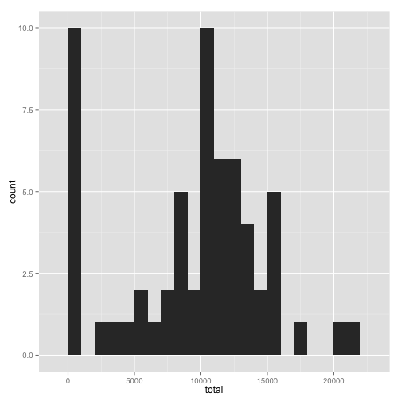
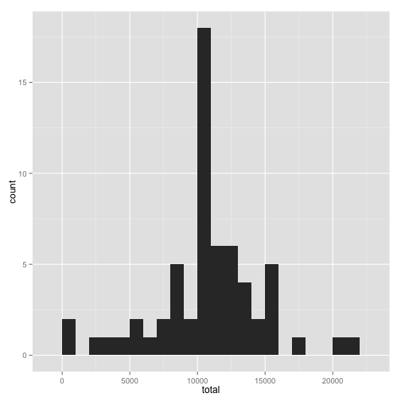
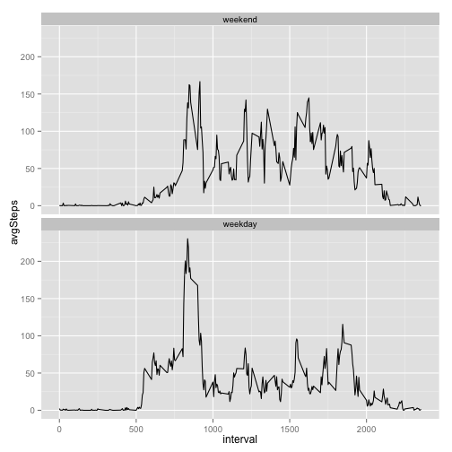

## Loading and Preprocessing the Data
Load the data using read.csv()

```r
T = read.csv("~/DataScience/class/ReproducibleResearch/assignment1/activity.csv")
```
Identify data content in the table for analysis

```r
str(T)
```

```
## 'data.frame':	17568 obs. of  3 variables:
##  $ steps   : int  NA NA NA NA NA NA NA NA NA NA ...
##  $ date    : Factor w/ 61 levels "2012-10-01","2012-10-02",..: 1 1 1 1 1 1 1 1 1 1 ...
##  $ interval: int  0 5 10 15 20 25 30 35 40 45 ...
```

```r
summary(T)
```

```
##      steps                date          interval     
##  Min.   :  0.00   2012-10-01:  288   Min.   :   0.0  
##  1st Qu.:  0.00   2012-10-02:  288   1st Qu.: 588.8  
##  Median :  0.00   2012-10-03:  288   Median :1177.5  
##  Mean   : 37.38   2012-10-04:  288   Mean   :1177.5  
##  3rd Qu.: 12.00   2012-10-05:  288   3rd Qu.:1766.2  
##  Max.   :806.00   2012-10-06:  288   Max.   :2355.0  
##  NA's   :2304     (Other)   :15840
```
## What is mean total number of steps taken per day?
Use the magic of dplyr library to do grouped statistics. Load the library and then use the ddply function to sum the steps per day for data analysis and plotting. For summing the data, we'll ignore the NA data per instructions.

```r
library(plyr)
stepsPerDay =  ddply(T,.(date),summarize,total=sum(steps,na.rm = TRUE))
```
Make a histogram of the total number of steps taken each day

```r
library(ggplot2)
ggplot(stepsPerDay, aes(x=total)) + geom_histogram(binwidth=1000)
```

 
Calculate and report the mean and median of the total number of steps taken per day

```r
summary(stepsPerDay$total)
```

```
##    Min. 1st Qu.  Median    Mean 3rd Qu.    Max. 
##       0    6778   10400    9354   12810   21190
```

## What is the average daily activity pattern?
Now we need to partition the data not by day, rather aggregate data for intervals of each day. Again the plyr library can be used for grouping data statistics

```r
stepsPerInterval = ddply(T,.(interval),summarize,avgSteps = mean(steps,na.rm = TRUE))
summary(stepsPerInterval$avgSteps)
```

```
##    Min. 1st Qu.  Median    Mean 3rd Qu.    Max. 
##   0.000   2.486  34.110  37.380  52.830 206.200
```
Make a time series plot of the 5-minute interval and the average number of steps taken, averaged across all days.

```r
ggplot(data=stepsPerInterval, aes(x=interval, y=avgSteps)) + geom_line()
```

 

Which 5-minute interval, on average across all the days in the dataset, contains the maximum number of steps?

```r
MaxSteps = max(stepsPerInterval$avgSteps)
MaxInterval = stepsPerInterval$interval[which.max(stepsPerInterval$avgSteps)]
MaxSteps
```

```
## [1] 206.1698
```

```r
MaxInterval
```

```
## [1] 835
```
## Imputing missing values
Now we wish to identify and remove NA's from the data set to sanitize the analysis and prevent bias in the results. We are asked to identify rows that contain NA in the original data. Summary of the data already showed that NA's occurred on steps and there are 2304 NA's in the data.      
1. Calculate and report the total number of missing values in the dataset (i.e. the total number of rows with NAs)

```r
naRows = which(is.na(T$steps))
length(naRows)
```

```
## [1] 2304
```

2. Devise a strategy for filling in all of the missing values in the dataset.   
We chose a strategy of replacing NA by mean steps grouping across the interval.
3. Create a new dataset that is equal to the original dataset but with the missing data filled in

```r
library(dplyr)
naReplacedT<-T %>% group_by(interval) %>% mutate(steps = ifelse(is.na(steps), mean(steps, na.rm = TRUE), steps))
```
4. Make a histogram of the total number of steps taken each day. Do these values differ from the estimates from the first part of the assignment? What is the impact of imputing missing data on the estimates of the total daily number of steps?

```r
noNaStepsPerDay = ddply(naReplacedT,.(date),summarize,total=sum(steps))
ggplot(noNaStepsPerDay, aes(x=total)) + geom_histogram(binwidth=1000)
```

 

Calculate and report the mean and median total number of steps taken per day.

```r
summary(noNaStepsPerDay$total)
```

```
##    Min. 1st Qu.  Median    Mean 3rd Qu.    Max. 
##      41    9819   10770   10770   12810   21190
```

What is the impact of imputing missing data on the estimates of the total daily number of steps?   
Answer: With the replacement of na, the lower end of the distribution moved to the right. Here is the comparison:
                            Min. 1st Qu.  Median    Mean 3rd Qu.    Max. 
StepsPerDayWithNA             0    6778   10400    9354   12810   21190 
StepsPerDayWithNA Replaced:  41    9819   10770   10770   12810   21190 

## Are there differences in activity patterns between weekdays and weekends?
1. Create a new factor variable in the dataset with two levels – “weekday” and “weekend” indicating whether a given date is a weekday or weekend day.   
We are using timeDate library to compare a date as a weekday or weekend.

```r
library(timeDate)
naReplacedT$weekDay <- factor(isWeekday(naReplacedT$date, wday=1:5), levels=c(FALSE, TRUE), labels=c('weekend', 'weekday'))
```
2. Make a panel plot containing a time series plot (i.e. type = "l") of the 5-minute interval (x-axis) and the average number of steps taken, averaged across all weekday days or weekend days (y-axis). 

```r
stepsPerIntervalWeekDay <- ddply(naReplacedT,.(interval,weekDay),summarize,avgSteps = mean(steps))
ggplot(data=stepsPerIntervalWeekDay, aes(x=interval, y=avgSteps)) + geom_line()+facet_wrap(~weekDay, nrow=2)
```

 

